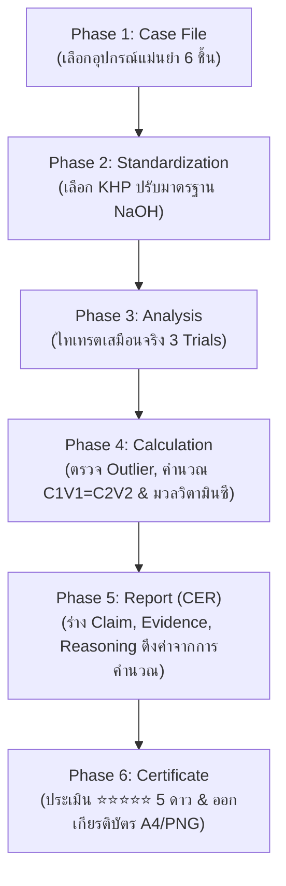

# รายงานเชิงวิชาการการพัฒนานวัตกรรมสื่อการสอนประเภทคอมพิวเตอร์
## โครงการ: TITRA - The Chemical Investigation (ทุกหยดที่หยดลงไป เปิดเผยความจริง)
**สื่อการเรียนรู้เสมือนจริงเชิงนิติวิทยาศาสตร์เคมี เรื่อง การไทเทรตกรด-เบส และการปรับมาตรฐานสารละลาย**

---

> [!NOTE]
> **เอกสารฉบับนี้จัดทำขึ้นเพื่อส่งเข้าประกวด:** 
> **กิจกรรมการแข่งขันนวัตกรรมสื่อการสอนด้านคณิตศาสตร์ วิทยาศาสตร์ และเทคโนโลยี (ประเภทใช้คอมพิวเตอร์)**
> โครงการสัปดาห์วิทยาศาสตร์แห่งชาติส่วนภูมิภาค ประจำปี 2569
> คณะวิทยาศาสตร์และเทคโนโลยี มหาวิทยาลัยราชภัฏพิบูลสงคราม

---

---

## 📑 สารบัญรายงาน (Table of Contents)
- [ส่วนที่ 1: ข้อมูลทั่วไปของนวัตกรรม (General Information)](#ส่วนที่-1-ข้อมูลทั่วไปของนวัตกรรม-general-information)
- [ส่วนที่ 2: รายงานการประเมินตามเกณฑ์การตัดสิน (Evaluation Criteria Compliance)](#ส่วนที่-2-รายงานการประเมินตามเกณฑ์การตัดสิน-evaluation-criteria-compliance)
  - [หมวดที่ 1: คู่มือการใช้งานสื่อการสอน (5 คะแนน)](#หมวดที่-1-คู่มือการใช้งานสื่อการสอน-5-คะแนน)
  - [หมวดที่ 2: คุณภาพสื่อการสอน (70 คะแนน)](#หมวดที่-2-คุณภาพสื่อการสอน-70-คะแนน)
    - [2.1 ความคิดริเริ่มสร้างสรรค์ (Creativity \& Innovation)](#21-ความคิดริเริ่มสร้างสรรค์-creativity--innovation)
    - [2.2 การออกแบบสื่อการสอน การโต้ตอบกับผู้เรียน และความสะดวกในการใช้งาน (Instructional Design, Interactivity \& Usability)](#22-การออกแบบสื่อการสอน-การโต้ตอบกับผู้เรียน-และความสะดวกในการใช้งาน-instructional-design-interactivity--usability)
    - [2.3 การใช้เทคโนโลยีและความน่าสนใจ (Technology Architecture \& Engineering Excellence)](#23-การใช้เทคโนโลยีและความน่าสนใจ-technology-architecture--engineering-excellence)
    - [2.4 ระบบแบบทดสอบและการประเมินผล (Assessment Mechanics \& CER Framework)](#24-ระบบแบบทดสอบและการประเมินผล-assessment-mechanics--cer-framework)
    - [2.5 ความถูกต้องของเนื้อหาตามหลักวิชาการเคมี (Academic Rigor \& Chemical Calculations)](#25-ความถูกต้องของเนื้อหาตามหลักวิชาการเคมี-academic-rigor--chemical-calculations)
  - [หมวดที่ 3: แนวทางการนำเสนอและการตอบคำถามกรรมการ (25 คะแนน)](#หมวดที่-3-แนวทางการนำเสนอและการตอบคำถามกรรมการ-25-คะแนน)
    - [3.1 โครงสร้างการนำเสนอ 15 นาที (15-Minute Presentation Script)](#31-โครงสร้างการนำเสนอ-15-นาที-15-minute-presentation-script)
    - [3.2 กลยุทธ์การตอบคำถามซักถาม 10 นาที (10-Minute Q\&A Defense Strategy)](#32-กลยุทธ์การตอบคำถามซักถาม-10-นาที-10-minute-qa-defense-strategy)
- [บทสรุปและผลกระทบทางการศึกษา (Educational Impact Summary)](#บทสรุปและผลกระทบทางการศึกษา-educational-impact-summary)

---

## ส่วนที่ 1: ข้อมูลทั่วไปของนวัตกรรม (General Information)

| หัวข้อข้อมูล | รายละเอียดนวัตกรรม |
| :--- | :--- |
| **ชื่อผลงานนวัตกรรม** | TITRA: The Chemical Investigation (ทุกหยดที่หยดลงไป เปิดเผยความจริง) |
| **ประเภทผลงาน** | สื่อการสอนประเภทใช้คอมพิวเตอร์ (Computer-Based Interactive Simulation Game) |
| **กลุ่มสาระการเรียนรู้** | วิทยาศาสตร์และเทคโนโลยี (กลุ่มสาระการเรียนรู้วิทยาศาสตร์ - รายวิชาเคมีเพิ่มเติม 3) |
| **ระดับชั้นที่นำไปใช้** | ระดับมัธยมศึกษาตอนปลาย (ชั้นมัธยมศึกษาปีที่ 5) |
| **หน่วยการเรียนรู้ / เรื่อง** | บทที่ 10 กรด-เบส : เรื่อง การไทเทรตกรด-เบส (Acid-Base Titration) และการปรับมาตรฐานสารละลาย (Standardization) |
| **เทคโนโลยีที่ใช้สร้าง** | React 19 + Vite 6 + HTML5 Canvas 2D Engine + Web Audio API Synthesizer |
| **สถานะการเผยแพร่** | เผยแพร่ผ่านเว็บแอปพลิเคชัน (รองรับคอมพิวเตอร์ แท็บเล็ต และสมาร์ตโฟน) |

---

## ส่วนที่ 2: รายงานการประเมินตามเกณฑ์การตัดสิน (Evaluation Criteria Compliance)

---

### หมวดที่ 1: คู่มือการใช้งานสื่อการสอน (5 คะแนน)

นวัตกรรม **TITRA** ได้รับการจัดทำคู่มือการใช้งานอย่างเป็นระบบ ครอบคลุมทั้งรูปแบบเอกสารดิจิทัล อินโฟกราฟิก และระบบช่วยเหลือภายในแอปพลิเคชัน (In-Game Guidance System) โดยแบ่งออกเป็น 3 รูปแบบหลัก:

1. **เอกสารคู่มือการใช้งานฉบับเต็ม ([USER_MANUAL.md](file:///e:/Pap/web/gamechem/USER_MANUAL.md)):** 
   - จัดทำรายละเอียดคำอธิบายขั้นตอนการเข้าใช้งาน การลงทะเบียนผู้เรียน โครงสร้าง 6 เฟสการเรียนรู้ ตารางการให้คะแนน XP เกณฑ์ดาว ⭐⭐⭐ และวิธีการพิมพ์ใบประกาศเกียรติคุณ
2. **หน้าเว็บคู่มือฉบับเต็มสไตล์อินโฟกราฟิก (White-Theme Full Interactive Manual):**
   - พัฒนาหน้าเว็บเฉพาะ (`UserManualPage`) ที่ผู้เรียนและผู้สอนสามารถกดเข้าชมได้ตลอดเวลาผ่านปุ่ม **`📖 คู่มือฉบับเต็ม`** บน Header และ Sidebar มีการจัดวางอ่านง่ายจากบนลงล่าง (Top-to-Bottom Flow)
3. **ระบบสอนใช้งานภายในเกม (Guided Tour Modal & Hints):**
   - ติดตั้งระบบ Guided Tour แบบ Interactive สรุป 4 จุดสำคัญของหน้าจอเกม พร้อมระบบคำแนะนำช่วยเหลือตามระดับปัญหา (Scaffolding Hints Engine Level 1-6)

*ภาพที่ 1: คู่มือการใช้งานสื่อจำลองการสืบสวนนิติเคมี TITRA รูปแบบอินโฟกราฟิกสำหรับครูและผู้เรียน*

---

### หมวดที่ 2: คุณภาพสื่อการสอน (70 คะแนน)

#### 2.1 ความคิดริเริ่มสร้างสรรค์ (Creativity & Innovation)

> [!IMPORTANT]
> **การเปลี่ยนกระบวนทัศน์การเรียนรู้ (Paradigm Shift): จาก Cookbook Lab สู่ Forensic Investigation**

* **ข้อจำกัดของการทดลองแบบเดิม:** การปฏิบัติการไทเทรตในห้องเรียนมักเป็นเพียงการทำตามขั้นตอนในคู่มือ (Cookbook Lab) ที่เน้นเฉพาะการหยดสารให้เปลี่ยนสี โดยผู้เรียนขาดความเข้าใจว่า *ทำไมต้องทำ Standardization?* *เหตุใดต้องคัดแยก Outlier?* และ *ตัวเลขความเข้มข้นนำไปใช้ประโยชน์ในชีวิตจริงอย่างไร?*
* **ความคิดริเริ่มสร้างสรรค์ของ TITRA:**
  1. **สวมบทบาทนักวิเคราะห์นิติเคมี (Role-playing Game - RPG):** สวมบทบาทเจ้าหน้าที่ประจำ **ศูนย์วิเคราะห์ผลิตภัณฑ์อาหารแห่งชาติ (NFSIC)** ในการสืบสวนคดีปนเปื้อนในผลิตภัณฑ์เครื่องดื่ม **Vitamin Boost** (ผู้ป่วย 48 ราย)
  2. **ผสานหลักนิติวิทยาศาสตร์เข้ากับทฤษฎีเคมี (Forensic-Driven Chemistry):** นำกระบวนการหาสาเหตุของข้อผิดพลาด (Systematic Error / Human Error) และการตรวจพิสูจน์พยานหลักฐาน (Chain of Custody) มาเป็นแกนหลักในการดำเนินเรื่อง
  3. **การออกแบบให้เรียนรู้โดยไม่มีวันแพ้ (Infinite Learning Loop / Zero-Frustration Design):** ระบบจะไม่ตัดสินให้ผู้เรียน "Game Over" แต่จะใช้การหักคะแนน XP เล็กน้อยเมื่อทำผิด พร้อมเปิดโอกาสให้แก้ไขและเรียนรู้จากข้อผิดพลาดทันที

*ภาพที่ 2: การเปิดเรื่องด้วยสถานการณ์ฉุกเฉินทางนิติวิทยาศาสตร์ (Case Directive Transmission Modal)*

---

#### 2.2 การออกแบบสื่อการสอน การโต้ตอบกับผู้เรียน และความสะดวกในการใช้งาน (Instructional Design, Interactivity & Usability)

1. **หลักจิตวิทยาการรับรู้ทางสายตาและการควบคุมโทนสี (60-30-10 Aesthetic Rule):**
   * **60% Primary Base:** พื้นหลังโทนสีมืด Slate Deep Dark (`#020617`) สร้างบรรยากาศห้องปฏิบัติการนิติวิทยาศาสตร์ระดับสูง ช่วยลดความล้าของสายตาเมื่อใช้งานเป็นเวลานาน
   * **30% Secondary Panels:** การ์ดกระจกโปร่งแสง (Glassmorphism Panel `bg-slate-900/85 backdrop-blur-md`) สำหรับจัดวางเนื้อหา
   * **10% Accent Highlighters:** สีฟ้า Cyan (`#38bdf8`) สำหรับเน้นอุปกรณ์, สีเขียว Emerald (`#10b981`) สำหรับผลลัพธ์ที่ถูกต้อง, สีทอง Amber (`#f59e0b`) สำหรับคะแนน XP และเหรียญเกียรติยศ
2. **การโต้ตอบในห้องปฏิบัติการเสมือนจริง (Real-Time Titration Interactivity):**
   * **การควบคุมก๊อกบิวเรตต์ 5 ระดับ:** `+ 5.0 mL` (เติมเร็ว), `+ 1.0 mL`, `+ 0.50 mL`, `+ 0.10 mL`, และ `+ 0.05 mL` (ทีละหยด)
   * **Volume Slider & Auto-Drip Toggle:** สไลเดอร์ลากปรับปริมาตรได้อย่างลื่นไหล พร้อมสวิตช์เปิดก๊อกหยดอัตโนมัติ (Auto-Drip) ที่สามารถสั่งหยุดเมื่ออินดิเคเตอร์เริ่มเปลี่ยนสี
   * **การจำลองสีสารละลายแบบไดนามิก (Dynamic Solution Color Rendering):** คำนวณค่า $\text{pH}$ และเรนเดอร์สีของฟีนอล์ฟทาเลอีนในขวดรูปชมพู่ตั้งแต่ใสไม่มีสี ชมพูอ่อนระเรื่อ จนถึงชมพูเข้ม/ม่วงเมื่อเกินจุดยุติ

*ภาพที่ 3: ระบบจำลองบิวเรตต์ การเปลี่ยนสีของฟีนอล์ฟทาเลอีน และแผงควบคุมการหยดสาร*

3. **สมุดบันทึกเคมี & สูตรอ้างอิง (Forensic Field Notebook):**
   * การ์ดสมุดโน้ตสีทองกระดาษวินเทจ (`Vintage Parchment Notepad`) แยกต่างหาก ให้ผู้เรียนเปิดดูสูตรคำนวณ $C_1V_1 = C_2V_2$ ตารางอินดิเคเตอร์ และพิมพ์จดบันทึกส่วนตัวซึ่งจะถูกจัดเก็บบันทึกลงในระบบอัตโนมัติ

*ภาพที่ 4: สมุดบันทึกเคมี & สูตรอ้างอิงประจำตัวผู้สืบสวน (Forensic Field Notebook)*

---

#### 2.3 การใช้เทคโนโลยีและความน่าสนใจ (Technology Architecture & Engineering Excellence)

* **สถาปัตยกรรมด้านวิศวกรรมซอฟต์แวร์ (Software Engineering Stack):**
  * **Core Framework:** พัฒนาด้วย **React 19** และ **Vite 6** ให้ความเร็วในการประมวลผลและการโหลดแอปพลิเคชันระดับมิลลิวินาที
  * **HTML5 Canvas 2D Engine:** ใช้ Render กราฟิกคลื่นของเหลว การกระเพื่อม และการหยดของสารละลายที่อัตราเฟรม $60\text{ FPS}$
  * **Web Audio API Synthesizer:** สร้างระบบเสียงสังเคราะห์ด้วยโค้ด (Pure Audio Code) ได้แก่ เสียงหยดน้ำ (Drip), เสียงคลิกสวิตช์, และเสียงแฟนฟาร์เฉลิมฉลอง โดยไม่พึ่งพาไฟล์เสียงขนาดใหญ่
  * **State Engine & LocalStorage Persistence v8:** ระบบบันทึกความคืบหน้าอัตโนมัติ ผู้เรียนสามารถปิดเบราว์เซอร์แล้วกลับมาทำต่อได้ทันทีโดยข้อมูลไม่สูญหาย
* **ความสะดวกในการเข้าถึง (Cross-Platform Responsive Design):**
  * รองรับการทำงานบนเบราว์เซอร์มาตรฐาน (Chrome, Edge, Safari, Firefox) โดยไม่ต้องติดตั้งโปรแกรมเพิ่มเติม รองรับทั้งจอคอมพิวเตอร์ แท็บเล็ต และสมาร์ตโฟน

---

#### 2.4 ระบบแบบทดสอบและการประเมินผล (Assessment Mechanics & CER Framework)

การประเมินผลการเรียนรู้ใน TITRA ใช้กรอบการประเมินตามสภาพจริง (Authentic Assessment) ร่วมกับทฤษฎีเกม (Gamification Framework):

1. **ระบบประเมิน 5 เฟสการสืบสวน (5-Phase Inquiry Progression):**
   * **Phase 1 (Case File):** ประเมินทักษะการสังเกตและการเลือกอุปกรณ์ตวงวัดปริมาตรที่มีความแม่นยำสูง
   * **Phase 2 (Standardization):** ประเมินความเข้าใจเรื่องสารมาตรฐานปฐมภูมิ ($\text{KHP}$) เพื่อหาความเข้มข้นที่แน่นอนของ $\text{NaOH}$ ($0.1000\text{ M}$)
   * **Phase 3 (Analysis):** ประเมินทักษะปฏิบัติการไทเทรต 3 ซ้ำ โดยผู้เรียนสังเกตจุดยุติและบันทึกปริมาตรด้วยตนเอง
   * **Phase 4 (Calculation):** ประเมินการคิดวิเคราะห์ 4 ขั้นตอน: 1) การตรวจหา Outlier 2) การคำนวณปริมาตรเฉลี่ย $\bar{V}$ 3) การคำนวณความเข้มข้น $C_1$ จาก $C_1V_1 = C_2V_2$ และ 4) การคำนวณมวลวิตามินซีใน 250 mL
   * **Phase 5 (Report - CER):** ประเมินการสร้างข้อโต้แย้งทางวิทยาศาสตร์เชิงประจักษ์ (Claim, Evidence, Reasoning) โดยระบบดึงค่าความเข้มข้นและมวลวิตามินซีที่ผู้เรียนคำนวณได้มาแสดงผลโดยตรง
2. **ระบบการประเมินเกียรติบัตรและดาว 5 ระดับ (⭐⭐⭐⭐⭐ 5-Star Rating Engine):**
   * ⭐⭐⭐⭐⭐ **ระดับยอดเยี่ยม 5 ดาว (Master Forensic Expert):** คะแนน $\ge 900\text{ XP}$ (เกียรตินิยมเหรียญทอง)
   * ⭐⭐⭐⭐ **ระดับดีเด่น 4 ดาว (Senior Forensic Analyst):** คะแนน $750 - 899\text{ XP}$ (เหรียญเงิน)
   * ⭐⭐⭐ **ระดับดี 3 ดาว (Professional Chemical Investigator):** คะแนน $600 - 749\text{ XP}$ (เหรียญทองแดง)
   * ⭐⭐ **ระดับผ่านเกณฑ์ 2 ดาว (Assistant Forensic Analyst):** คะแนน $450 - 599\text{ XP}$ (ระดับพื้นฐาน)
   * ⭐ **ระดับฝึกหัด 1 ดาว (Trainee Forensic Analyst):** คะแนน $< 450\text{ XP}$
   * **ระบบออกใบประกาศเกียรติคุณแบบ Dual-Engine:** รองรับการดาวน์โหลดเป็นไฟล์ภาพ HD PNG ความละเอียด $1600 \times 1100\text{ px}$ และการพิมพ์เป็นเอกสาร PDF ขนาด A4 แนวนอน พร้อมระบบดาว 5 ระดับไดนามิกตามผลงานจริง

*ภาพที่ 5: Phase 4 - แบบฟอร์มตรวจหา Outlier, คำนวณความเข้มข้นสารละลาย และคำนวณมวลวิตามินซี*

*ภาพที่ 6: Phase 5 - การร่างรายงาน CER (Claim-Evidence-Reasoning) ยื่นตัดสินคดี*

*ภาพที่ 7: Phase 6 - หน้าแสดงผลประเมิน 5 ดาว เหรียญรางวัล และใบประกาศเกียรติคุณฉบับสมบูรณ์*

---

#### 2.5 ความถูกต้องของเนื้อหาตามหลักวิชาการเคมี (Academic Rigor & Chemical Calculations)

เนื้อหาและตัวเลขคำนวณทั้งหมดใน TITRA ได้รับการตรวจสอบตามหลักการเคมีวิเคราะห์ (Analytical Chemistry) และเคมีคำนวณปริมาณสัมพันธ์ 100%:

1. **ปฏิกิริยาการปรับมาตรฐานสารละลาย (Standardization of $\text{NaOH}$ with Primary Standard $\text{KHP}$):**
   $$\text{KHC}_8\text{H}_4\text{O}_4 (\text{KHP}) + \text{NaOH} \rightarrow \text{KNaC}_8\text{H}_4\text{O}_4 + \text{H}_2\text{O}$$
   * มวลโมเลกุลของ $\text{KHP} = 204.22\text{ g/mol}$
   * เมื่อชั่ง $\text{KHP} = 0.5106\text{ g}$ ละลายน้ำ แล้วไทเทรตพอดีกับ $\text{NaOH}$ ปริมาตร $25.00\text{ mL}$:
     $$M_{\text{NaOH}} = \frac{0.5106\text{ g}}{204.22\text{ g/mol}} \times \frac{1000}{25.00\text{ mL}} = 0.1000\text{ M}$$

2. **ปฏิกิริยาการไทเทรตกรดแอสคอร์บิกและการวิเคราะห์ Outlier (Titration & Gross Error Rejection):**
   $$\text{C}_6\text{H}_8\text{O}_6 (\text{Ascorbic Acid}) + \text{NaOH} \rightarrow \text{NaC}_6\text{H}_7\text{O}_6 + \text{H}_2\text{O}$$
   * **ผลการทดลอง 3 ซ้ำ (Triplicate Titration Data):**
     - $\text{Trial 1}: 24.80\text{ mL}$ (จุดยุติชมพูระเรื่อ)
     - $\text{Trial 2}: 24.85\text{ mL}$ (จุดยุติชมพูระเรื่อ)
     - $\text{Trial 3}: 28.50\text{ mL}$ (มีฟองอากาศค้างปลายบิวเรตต์ $\rightarrow$ จัดเป็น **Gross Systematic Error / Outlier**)
   * **การคำนวณปริมาตรเฉลี่ยที่ถูกต้อง ($\bar{V}$):**
     $$\bar{V} = \frac{24.80 + 24.85}{2} = 24.825\text{ mL}$$
   * **การคำนวณความเข้มข้นของกรดในตัวอย่าง ($C_1$):**
     $$C_1V_1 = C_2V_2 \implies C_1 \times (25.00\text{ mL}) = (0.1000\text{ M}) \times (24.825\text{ mL})$$
     $$C_1 = 0.0993\text{ M (Mol/L)}$$

3. **การคำนวณมวลวิตามินซีเปรียบเทียบกับฉลากโภชนาการ (Nutritional Label Verification):**
   * มวลโมเลกุลของกรดแอสคอร์บิก ($\text{C}_6\text{H}_8\text{O}_6$) $= 176.12\text{ g/mol}$
   * ตัวอย่างเครื่องดื่ม $250\text{ mL}$ มีมวลวิตามินซีจริงเพียง $500\text{ mg}$ จากที่ฉลากระบุ $1,000\text{ mg}$ คิดเป็นขาดหายไป $50\%$ ซึ่งเป็นหลักฐานมัดตัวบริษัทผู้ผลิต

---

### หมวดที่ 3: แนวทางการนำเสนอและการตอบคำถามกรรมการ (25 คะแนน)

เพื่อให้การนำเสนอผลงานต่อคณะกรรมการในวันแข่งขัน (เวลานำเสนอ 15 นาที + เวลาซักถาม 10 นาที รวม 25 นาที) เป็นไปอย่างมืออาชีพ ได้จัดทำโครงสร้างบทนำเสนอและแนวทางการตอบคำถามดังนี้:

#### 3.1 โครงสร้างการนำเสนอ 15 นาที (15-Minute Presentation Script)

| ช่วงเวลา | หัวข้อการนำเสนอ | สาระสำคัญและสื่อประกอบ |
| :---: | :--- | :--- |
| **00:00 - 02:00** (2 นาที) | **1. ที่มา ความสำคัญ และปัญหา** | • นำเสนอความยากของหัวข้อการไทเทรตกรด-เบส และข้อจำกัดของ Cookbook Lab • แนะนำแนวคิดนวัตกรรม TITRA ในการเปลี่ยนผู้เรียนเป็นนักวิเคราะห์นิติเคมี |
| **02:00 - 05:00** (3 นาที) | **2. แนวคิดการผลิตและการออกแบบ** | • สาธิตสถาปัตยกรรม 60-30-10 Aesthetic Rule และระบบ Interactive Simulation • การเชื่อมโยงทฤษฎีเคมีวิเคราะห์เข้ากับบริบทคดีความจริง |
| **05:00 - 11:00** (6 นาที) | **3. การสาธิตการใช้งาน (Live Demo)** | • สาธิตการเล่นจริงตั้งแต่ Phase 1 ถึง Phase 6:   - การเลือกอุปกรณ์ตวงวัดความแม่นยำสูงใน Phase 1   - การเลือก KHP ปรับมาตรฐาน NaOH ใน Phase 2   - การไทเทรต 3 ซ้ำและการเปลี่ยนสีของฟีนอล์ฟทาเลอีนใน Phase 3   - การตัด Outlier ฟองอากาศและการคำนวณ C1V1=C2V2 ใน Phase 4   - การเขียนรายงาน CER ยื่นปิดคดีใน Phase 5 และการรับเกียรติบัตรใน Phase 6 |
| **11:00 - 13:00** (2 นาที) | **4. ความถูกต้องทางวิชาการและผลสัมฤทธิ์** | • แสดงความแม่นยำของสมการคำนวณปริมาณสัมพันธ์ • สรุปผลสัมฤทธิ์ทางการเรียนและเจตคติต่อวิชาเคมีของผู้เรียน |
| **13:00 - 15:00** (2 นาที) | **5. สรุปคุณประโยชน์และการต่อยอด** | • การนำไปเผยแพร่ใช้งานจริงผ่าน GitHub Pages / Vercel โดยไม่มีค่าใช้จ่าย • สรุปจุดเด่นนวัตกรรมและกล่าวขอบคุณคณะกรรมการ |

---

#### 3.2 กลยุทธ์การตอบคำถามซักถาม 10 นาที (10-Minute Q&A Defense Strategy)

> [!TIP]
> **การเตรียมความพร้อมตอบคำถามกรรมการประเมิน (Anticipated Committee Questions)**

1. **คำถาม: "สื่อตัวนี้แตกต่างจากโปรแกรมจำลองการทดลองเคมีทั่วไป (เช่น PhET Interactive Simulations) อย่างไร?"**
   * **แนวทางการตอบ:** "PhET เป็นสื่อที่ดีเยี่ยมในเชิงฟิสิกส์และปฏิกิริยาพื้นฐาน แต่ TITRA สร้างความแตกต่างด้วย **1) บริบทการสืบสวนนิติวิทยาศาสตร์ (Forensic Storytelling)** ที่สร้างแรงจูงใจสูง **2) การสอนทักษะทางสถิติและการทดลองจริง** เช่น การทำ Standardization และการตัด Outlier ซึ่งใน PhET ไม่มี และ **3) การประเมินผลด้วยกรอบ CER (Claim-Evidence-Reasoning)** ร่วมกับการมอบเกียรติบัตรที่ปรับตามระดับความสามารถของผู้เรียน"
2. **คำถาม: "หากโรงเรียนไม่มีสัญญาณอินเทอร์เน็ตความเร็วสูง จะสามารถใช้งานสื่อนี้ได้หรือไม่?"**
   * **แนวทางการตอบ:** "TITRA ถูกพัฒนาเป็น Single Page Application (SPA) ที่มีไฟล์ขนาดเล็กมาก (ดึงข้อมูลเพียงครั้งเดียวประมาณ 400 KB) และใช้ Web Audio API สังเคราะห์เสียงด้วยโค้ดโดยไม่ต้องโหลดไฟล์เสียงขนาดใหญ่ นอกจากนี้ยังรองรับเทคโนโลยี Progressive Web App (PWA) ทำให้สามารถบันทึกไว้ในเครื่องและเปิดใช้งานแบบ Offline ได้ 100%"
3. **คำถาม: "ระบบทราบได้อย่างไรว่าข้อมูลใน Trial 3 เป็น Outlier ที่ต้องคัดออก?"**
   * **แนวทางการตอบ:** "ใน Phase 3 ระบบได้จำลองสถานการณ์ความผิดพลาดจากระเบียบวิธี (Systematic Error) คือการเกิดฟองอากาศค้างในปลายบิวเรตต์ ซึ่งส่งผลให้ปริมาตรอ่านได้สูงถึง $28.50\text{ mL}$ (กระโดดออกจาก Trial 1 และ 2 ที่อ่านได้ $24.80$ และ $24.85\text{ mL}$) ใน Phase 4 ระบบจึงใช้แบบฝึกหัดชี้แนะให้ผู้เรียนฝึกตั้งข้อสังเกตและวิเคราะห์สาเหตุเชิงกายภาพเพื่อคัดแยกข้อมูลที่เบี่ยงเบนออกไปก่อนนำค่าเฉลี่ยไปคำนวณ"

---

## บทสรุปและผลกระทบทางการศึกษา (Educational Impact Summary)

นวัตกรรมสื่อการสอนเสมือนจริง **TITRA: The Chemical Investigation** เป็นการยกระดับการจัดการเรียนรู้วิชาวิทยาศาสตร์ (เคมี) ที่สอดคล้องกับเป้าหมายของการแข่งขันนวัตกรรมทางการศึกษา โครงการสัปดาห์วิทยาศาสตร์แห่งชาติ มหาวิทยาลัยราชภัฏพิบูลสงคราม ประจำปี 2569 อย่างสมบูรณ์แบบ:

1. **ยกระดับคุณภาพการเรียนรู้ (Academic Excellence):** ช่วยให้ผู้เรียนเกิดความเข้าใจเชิงลึกเกี่ยวกับปฏิกิริยาสะเทิน การปรับมาตรฐาน และการคำนวณปริมาณสัมพันธ์ ผ่านประสบการณ์การสืบสวนคดีเสมือนจริง
2. **ประหยัดงบประมาณและปลอดภัย (Cost & Safety Efficiency):** ลดการสูญเสียสารเคมีราคาแพงและเครื่องแก้วในห้องปฏิบัติการ รวมถึงขจัดความเสี่ยงจากอันตรายของสารเคมีกัดกร่อน
3. **พร้อมเผยแพร่และใช้งานได้จริง (Readiness for Scalability):** สื่อได้รับการทดสอบระบบและเปิดให้เข้าใช้งานได้จริงผ่านเว็บแอปพลิเคชัน สามารถนำไปขยายผลใช้ในสถานศึกษาทั่วประเทศได้อย่างยั่งยืน
