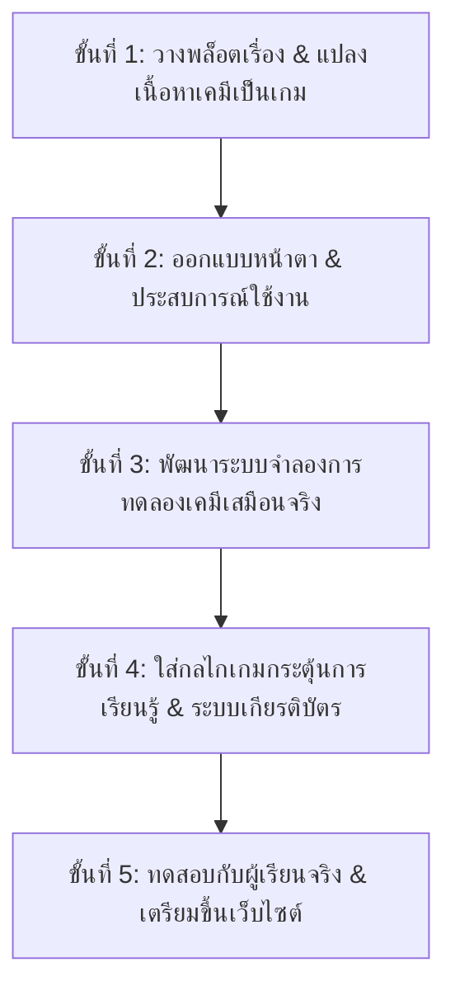

# เบื้องหลังการสร้างสรรค์โปรเจกต์ TITRA: จากแนวคิดสู่ห้องแล็บเสมือนจริง
## (เรื่องเล่าขั้นตอนการพัฒนาฉบับภาษาธรรมชาติ เข้าใจง่าย สำหรับคณะกรรมการ)

---

### 🎙️ คำนำ: ทำไมเราถึงสร้างโปรเจกต์นี้ขึ้นมา?

ถ้าเราไปถามนักเรียนส่วนใหญ่ว่า **"คิดว่าการทดลองเคมีเรื่องการไทเทรต (Titration) เป็นอย่างไร?"** 
คำตอบที่เรามักจะได้ยินคือ:
* *"จำสูตร $C_1V_1 = C_2V_2$ ไปทำข้อสอบได้ แต่ไม่รู้ว่าชีวิตจริงเขาเอาไปทำอะไร"*
* *"ทำแล็บจริงกลัวทำเครื่องแก้วแตก กลัวสารเคมีหกเลอะมือ"*
* *"พอหยดสารเกินจนเป็นสีชมพูเข้ม แล็บก็พังแล้ว แต่ไม่มีโอกาสได้ลองทำซ้ำเพราะสารเคมีหมด"*

พวกเราจึงตั้งโจทย์ร่วมกันว่า: **"จะเป็นไปได้ไหม ถ้าเราเปลี่ยนการทำแล็บเคมีที่น่าเบื่อ ให้กลายเป็น 'เกมสืบสวนคดีนิติวิทยาศาสตร์' ที่ตื่นเต้นเหมือนในซีรีส์สืบสวน? ให้นักเรียนได้สวมบทบาทเป็นนักวิทยาศาสตร์ที่ต้องใช้เคมีจริง ๆ ไปไขคดีและช่วยเหลือผู้คน"**

นี่คือจุดกำเนิดของโปรเจกต์ **TITRA: The Chemical Investigation** และนี่คือขั้นตอนทั้งหมดที่เราลงมือสร้างมันขึ้นมาครับ!

---

---

## 🧭 5 ขั้นตอนหลักในการพัฒนาโปรเจกต์ TITRA

---

### 📍 ขั้นตอนหลักที่ 1: วางพล็อตเรื่องและแปลงเนื้อหาเคมีเป็นเกม (Story & Pedagogy Design)

เป้าหมายของขั้นตอนนี้คือ **"ทำวิชาเคมีให้มีชีวิต มีเป้าหมาย และมีความหมายต่อผู้เรียน"**

* **ขั้นตอนย่อย 1.1 — ผูกเรื่องราวกับเหตุการณ์ใกล้ตัว (The Case Scenario):**
  เราสร้างคดีสมมติชื่อ **"The Vitamin Boost Investigation"** เกิดเหตุประชาชน 48 รายล้มป่วยหลังดื่มเครื่องดื่มวิตามินซี และแล็บภายนอก 3 แห่งตรวจผลออกมาขัดแย้งกันอย่างสิ้นเชิง ผู้เรียนจึงต้องเข้ามาเป็น **"นักวิเคราะห์นิติเคมี"** สังกัดศูนย์วิเคราะห์อาหารแห่งชาติ (NFSIC) เพื่อค้นหาความจริง

* **ขั้นตอนย่อย 1.2 — ซอยเนื้อหาเคมีออกเป็น 5 ด่านที่ร้อยเรียงกัน (The 5-Phase Inquiry Pipeline):**
  เราไม่ได้ให้เด็กเข้ามาแล้วไทเทรตเลย แต่จัดลำดับการคิดเหมือนนักวิทยาศาสตร์ตัวจริง:
  1. **ด่านที่ 1 (ไฟล์คดี):** ฝึกสังเกตข่าว ตรวจฉลาก และเลือกเครื่องแก้วแม่นยำสูง (บิวเรตต์, ปิเปตต์)
  2. **ด่านที่ 2 (สารมาตรฐาน):** เรียนรู้ว่าทำไมผลแล็บถึงไม่ตรงกัน ➔ สรุปได้ว่าต้องใช้ **KHP (Primary Standard)** ปรับมาตรฐาน NaOH ให้แน่นอนก่อน
  3. **ด่านที่ 3 (การไทเทรต):** ลงมือหยดสารจริง 3 ซ้ำ (3 Trials) เพื่อสังเกตจุดยุติสีชมพูระเรื่อ
  4. **ด่านที่ 4 (การคำนวณ):** ฝึกสถิตินิติวิทยาศาสตร์ ➔ คัดแยก Outlier (Trial 3 ที่มีฟองอากาศ) ออก แล้วคำนวณความเข้มข้นที่แท้จริง
  5. **ด่านที่ 5 (สรุปคำตัดสิน):** ร่างรายงานตามหลัก **CER (Claim-Evidence-Reasoning)** ยื่นตัดสินคดี

* **ขั้นตอนย่อย 1.3 — สร้างตัวละครพี่เลี้ยง (Character Mentorship):**
  ออกแบบตัวละคร **Director Alan** (ผู้อำนวยการผู้เข้มงวด มอบหมายภารกิจ) และ **Dr. Maya** (นักเคมีรุ่นพี่ที่คอยให้กำลังใจและชี้แนะเทคนิค) ทำให้นักเรียนรู้สึกมีเพื่อนร่วมทีม ไม่โดดเดี่ยว

---

### 📍 ขั้นตอนหลักที่ 2: ออกแบบหน้าตาและประสบการณ์ใช้งาน (UI/UX Design)

เป้าหมายคือ **"ทำให้หน้าตาโปรแกรมดูทันสมัย สบายตา ใช้ง่าย และเด็กเห็นแล้วอยากเล่น"**

* **ขั้นตอนย่อย 2.1 — ธีมห้องแล็บนิติเคมีกระจกโปร่งแสง (Chemical Glassmorphism):**
  เราใช้โทนสีมืด (Dark Slate) เป็นพื้นหลัง เพื่อลดความเมื่อยล้าของสายตาเมื่อจ้องจอนานๆ และใช้การ์ดกระจกโปร่งแสงที่มีแสงเรืองของสารเคมีอยู่ด้านหลัง ให้ความรู้สึกเหมือนกำลังใช้งานคอมพิวเตอร์ในห้องแล็บยุคอนาคต

* **ขั้นตอนย่อย 2.2 — สมุดบันทึกเคมีสีทอง (Forensic Field Notebook):**
  แยกเอกสารคู่มือและสูตรคำนวณออกมาเป็นปุ่ม **"สมุดบันทึกสีทองสไตล์กระดาษคลาสสิก"** นักเรียนสามารถคลิกเปิดดูสูตร $C_1V_1 = C_2V_2$ หรือตารางสีอินดิเคเตอร์ได้ตลอดเวลาโดยไม่ต้องกดสลับหน้าไปมา

* **ขั้นตอนย่อย 2.3 — ปรับฟอนต์และการอ่านง่าย (Readability First):**
  ใช้ฟอนต์ **IBM Plex Sans Thai** ปรับขนาดตัวหนังสือให้อ่านง่าย ชัดเจน ไม่เบียดอัด เพื่อให้ใช้งานได้ดีทั้งบนหน้าจอคอมพิวเตอร์และแท็บเล็ต

---

### 📍 ขั้นตอนหลักที่ 3: เขียนโปรแกรมและจำลองปฏิกิริยาเคมีเสมือนจริง (Interactive Simulation)

เป้าหมายคือ **"ให้การทดลองมีความแม่นยำตามหลักวิทยาศาสตร์ และโต้ตอบได้สมจริง 60 FPS"**

* **ขั้นตอนย่อย 3.1 — สร้างภาพเคลื่อนไหวบิวเรตต์และของเหลวด้วย HTML5 Canvas:**
  เราเขียนโปรแกรมวาดภาพบิวเรตต์และขวดรูปชมพู่ขึ้นมา โดยเมื่อผู้เรียนหยดสาร ระดับของเหลวในบิวเรตต์จะลดลง ของเหลวในขวดจะเพิ่มขึ้น และสารละลายจะคำนวณค่า pH แบบ Real-time เพื่อเปลี่ยนสีจากไม่มีสี $\rightarrow$ ชมพูระเรื่อ $\rightarrow$ ชมพูเข้ม

* **ขั้นตอนย่อย 3.2 — ออกแบบแผงควบคุมการหยดสารที่ยืดหยุ่น:**
  เพื่อให้ผู้เรียนควบคุมได้ตามใจชอบ เราจึงมีเครื่องมือควบคุมครบถ้วน:
  - ปุ่มกดหยดสารตามปริมาตร: `+ 5.0 mL`, `+ 1.0 mL`, `+ 0.50 mL`, `+ 0.10 mL`, `+ 0.05 mL`
  - แถบเลื่อนปรับปริมาตร (Volume Slider) ให้ลากเลื่อนได้อย่างอิสระ
  - ปุ่มเปิดก๊อกหยดต่อเนื่อง (Auto-Drip) เพื่อให้สารค่อยๆ หยดลงมาเองและกดหยุดได้เมื่อถึงจุดยุติ

* **ขั้นตอนย่อย 3.3 — ระบบเสียงสังเคราะห์ Web Audio API:**
  เขียนโค้ดสร้างคลื่นเสียงหยดน้ำ (Drop Drip) เสียงคลิกสวิตช์ และเสียงแฟนฟาร์แห่งชัยชนะขึ้นมาในตัวโปรแกรม ทำให้มีเสียงเอฟเฟกต์ที่คมชัด สนุกสนาน โดยไม่ต้องดาวน์โหลดไฟล์เสียงขนาดใหญ่ให้เปลืองเน็ต

---

### 📍 ขั้นตอนหลักที่ 4: ใส่ระบบเกมและเกียรติบัตร (Gamification & Evaluation)

เป้าหมายคือ **"สร้างแรงจูงใจ ให้รางวัลกับความพยายาม และวัดผลการเรียนรู้ได้จริง"**

* **ขั้นตอนย่อย 4.1 — ระบบสะสมคะแนน XP และเหรียญเกียรติยศ (5 Badges):**
  เมื่อผ่านแต่ละด่าน ผู้เรียนจะได้รับเหรียญรางวัล เช่น 🧪 `Lab Rookie`, 📏 `Precision Master`, 🎯 `Precision Analyst`, 🧠 `Critical Thinker`, และ 🏆 `Chief Investigator`

* **ขั้นตอนย่อย 4.2 — ระบบประเมินความสามารถด้วยจำนวนดาว (⭐⭐⭐ 3-Star Rating):**
  - ⭐⭐⭐ **3 ดาว (ระดับยอดเยี่ยม):** สำหรับผู้ที่วิเคราะห์ได้แม่นยำ คะแนน $\ge 700\text{ XP}$
  - ⭐⭐ **2 ดาว (ระดับดีเด่น):** คะแนน $500 - 699\text{ XP}$
  - ⭐ **1 ดาว (ระดับผ่านเกณฑ์):** คะแนน $< 500\text{ XP}$

* **ขั้นตอนย่อย 4.3 — ระบบออกเกียรติบัตรทันใจ (Dual-Engine Certificate):**
  เมื่อปิดคดีสำเร็จ ผู้เรียนจะเข้าสู่หน้าเกียรติบัตรฉบับทางการ ซึ่งสามารถ:
  1. กดปุ่ม **"📥 ดาวน์โหลดภาพเกียรติบัตร HD"** เพื่อบันทึกเป็นรูปภาพ `.png` คมชัดลงเครื่องทันที
  2. กดปุ่ม **"🖨️ พิมพ์หรือบันทึกเป็น PDF"** เพื่อสั่งพิมพ์ใส่กระดาษ A4 สวยงามพร้อมลายเซ็นสองฝ่าย

---

### 📍 ขั้นตอนหลักที่ 5: การทดสอบ ปรับปรุง และนำขึ้นเผยแพร่จริง (Testing & Deployment)

เป้าหมายคือ **"ให้ระบบเสถียร 100% ไม่มีค้าง ไม่มีบั๊ก และทุกคนเข้าใช้งานได้ฟรีผ่านอินเทอร์เน็ต"**

* **ขั้นตอนย่อย 5.1 — ทดสอบผ่านระบบจำลองเบราว์เซอร์อัตโนมัติ (Automated Browser Testing):**
  เราจำลองการคลิกและการทดลองจริงทุกขั้นตอน ตรวจสอบจนแน่ใจว่าไม่มีข้อผิดพลาดในระบบ (0 Errors)

* **ขั้นตอนย่อย 5.2 — ติดตั้งระบบนิรภัยป้องกันหน้าจอดับ (Global Error Boundary):**
  หากเกิดข้อผิดพลาดใดๆ จากเครื่องของผู้ใช้ ระบบจะแสดงหน้าต่างช่วยเหลือพร้อมปุ่มรีเซ็ตกู้คืนทันที ไม่เกิดปัญหาจอขาวหรือจอดำ

* **ขั้นตอนย่อย 5.3 — เตรียมระบบพร้อมออนไลน์ (Deploy Ready):**
  ตั้งค่าไฟล์พร้อมสำหรับนำขึ้น **GitHub Pages**, **Vercel** หรือ **Netlify** ให้นักเรียนทั่วประเทศเข้าเล่นได้ฟรีผ่านโทรศัพท์ แท็บเล็ต หรือคอมพิวเตอร์

---

## 🎯 สรุปสาระสำคัญสำหรับคณะกรรมการ (The Big Takeaways)

1. **ไม่ใช่แค่เกมตอบคำถาม แต่คือ "ห้องปฏิบัติการเสมือนจริง":** ผู้เรียนได้ลงมือควบคุมการทดลอง วิเคราะห์ข้อมูลดิบ ตัดข้อมูลที่ผิดพลาด และคำนวณจริงตามหลักการเคมี
2. **เน้นกระบวนการคิด (Higher-Order Thinking):** ไม่เน้นการท่องจำ แต่เน้นการสืบเสาะหาหลักฐานและการเขียนรายงานข้อสรุปตามกรอบ CER ที่เป็นมาตรฐานสากล
3. **ใช้งานได้จริงและประหยัดงบประมาณ:** ช่วยให้โรงเรียนประหยัดงบค่าสารเคมีและเครื่องแก้ว เปิดโอกาสให้เด็กได้ฝึกฝนซ้ำๆ จนเกิดความชำนาญก่อนเข้าห้องแล็บจริงครับ!
