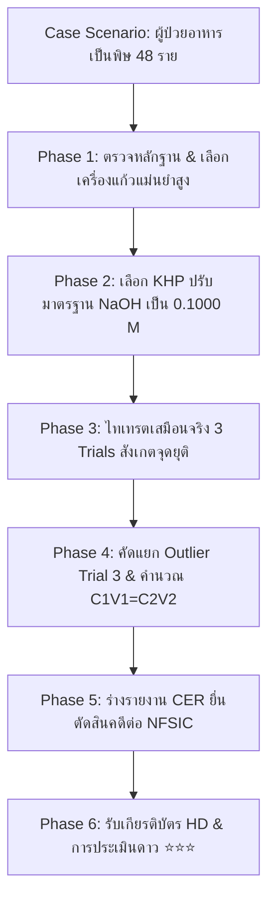

# รายงานสรุปเชิงเทคนิคและการพัฒนาโครงการสื่อการเรียนรู้จำลองนิติเคมี
## โครงการ: TITRA - The Chemical Investigation (ทุกหยดที่หยดลงไป เปิดเผยความจริง)
**เอกสารประกอบการนำเสนอต่อคณะกรรมการประเมินและผู้บริหารสถานศึกษา**

---

### 📑 สารบัญ (Table of Contents)
1. [บทนำและที่มาของโครงการ (Project Overview & Rationales)](#1-บทนำและที่มาของโครงการ)
2. [กรอบแนวคิดและการออกแบบการเรียนรู้ (Pedagogical & HCI Framework)](#2-กรอบแนวคิดและการออกแบบการเรียนรู้)
3. [โครงสร้างสถาปัตยกรรมทางเทคนิค (Technical Architecture)](#3-โครงสร้างสถาปัตยกรรมทางเทคนิค)
4. [กลไกการจำลองทางเคมีและ Gamification (Game Mechanics & Simulation Engine)](#4-กลไกการจำลองทางเคมีและ-gamification)
5. [ระบบประเมินผลและการออกเอกสารรับรอง (Evaluation & Certificate System)](#5-ระบบประเมินผลและการออกเอกสารรับรอง)
6. [การทดสอบความเสถียรและความปลอดภัยของระบบ (Testing & Resilience)](#6-การทดสอบความเสถียรและความปลอดภัยของระบบ)
7. [บทสรุปและแนวทางการพัฒนาต่อยอด (Conclusion & Future Roadmap)](#7-บทสรุปและแนวทางการพัฒนาต่อยอด)

---

## 1. บทนำและที่มาของโครงการ

### 1.1 ความเป็นมาและความสำคัญ
การเรียนการสอนวิชาเคมีในหัวข้อ **"การไทเทรตกรด-เบส (Acid-Base Titration)"** และ **"การคำนวณปริมาณสัมพันธ์ (Stoichiometry)"** มักประสบปัญหาผู้เรียนขาดความเข้าใจเชิงลึกเกี่ยวกับ:
1. ความสำคัญของสารมาตรฐานปฐมภูมิ (Primary Standard) ในการปรับมาตรฐานสารละลาย
2. ความแม่นยำของเครื่องแก้วตวงปริมาตร (Volumetric Glassware)
3. การตรวจหาและคัดแยกข้อมูลที่มีความคลาดเคลื่อนสูง (Outlier Rejection)
4. การสร้างข้อสรุปเชิงวิทยาศาสตร์บนพื้นฐานของหลักฐานเชิงประจักษ์ (Scientific Argumentation)

โครงการ **TITRA: The Chemical Investigation** ถูกพัฒนาขึ้นในรูปแบบของ **Interactive Forensic Web Simulation** เพื่อเปลี่ยนการทดลองในห้องแล็บให้เป็น **"ภารกิจสืบสวนคดีนิติวิทยาศาสตร์เคมีระดับชาติ (National Forensic Case File 01: The Vitamin Boost Investigation)"** โดยบูรณาการองค์ความรู้เคมีเข้ากับหลักการคิดวิเคราะห์ตามมาตรฐานวิทยาศาสตร์สากล

### 1.2 วัตถุประสงค์ของโครงการ
* เพื่อสร้างสื่อการเรียนรู้เสมือนจริงที่จำลองปรากฏการณ์ทางเคมี การเปลี่ยนสีของอินดิเคเตอร์ และการควบคุมเครื่องมือวัดปริมาตรได้อย่างถูกต้องแม่นยำ
* เพื่อส่งเสริมทักษะการสืบเสาะหาความรู้ การคิดเชิงวิพากษ์ (Critical Thinking) และการเขียนรายงานสรุปผลตามกรอบ **CER (Claim-Evidence-Reasoning)**
* เพื่อเปิดโอกาสให้ผู้เรียนสามารถฝึกปฏิบัติซ้ำได้ไม่จำกัด (Self-paced Learning) ปราศจากความเสี่ยงจากสารเคมีอันตรายและข้อจำกัดด้านงบประมาณอุปกรณ์

---

## 2. กรอบแนวคิดและการออกแบบการเรียนรู้

### 2.1 กรอบแนวคิดเชิงวิทยาศาสตร์และการศึกษา (Pedagogical Framework)
โครงการถูกออกแบบโดยอิงตาม Game Design Document (GDD) และทฤษฎีการเรียนรู้ 4 มิติ:



1. **Inquiry-Based Learning (การเรียนรู้เชิงสืบเสาะ):** วางตัวผู้เรียนในบทบาท *Junior Forensic Analyst* สังกัดศูนย์วิเคราะห์ผลิตภัณฑ์อาหารแห่งชาติ (NFSIC)
2. **Scaffolding & Adaptive Assistance (การเสริมต่อการเรียนรู้แบบยืดหยุ่น):**
   - ระบบคำแนะนำ 6 ระดับ (6-Level Adaptive Hint System) ตั้งแต่การชี้แนะแนวคิดไปจนถึงการอธิบายหลักการวิทยาศาสตร์
   - ตัวช่วยคำนวณแบบ Step-by-Step (พร้อมระบบหักคะแนนช่วยเหลือเพื่อรักษาความท้าทาย)
3. **Claim-Evidence-Reasoning (CER Framework):** ฝึกการอ้างอิงข้อมูลตัวเลขจากการทดลองจริงเพื่อสนับสนุนข้อสรุป ไม่ใช้การคาดเดา

### 2.2 การออกแบบประสบการณ์ผู้ใช้ (HCI & UX/UI Principles)
* **Chemical Glassmorphism Design System (กฎสี 60-30-10):**
  - **60% Primary Background:** Dark Slate 950 (`#020617`) สร้างบรรยากาศห้องปฏิบัติการนิติเคมีที่ทันสมัย น่าค้นหา
  - **30% Card & Workstation Surfaces:** กระจกห้องแล็บโปร่งแสง (`bg-slate-900/85 backdrop-blur-md border border-slate-700/70`)
  - **10% Accent Highlighters:** ฟ้า Cyan (`#38bdf8`), มรกต Emerald (`#10b981`), และทอง Amber (`#f59e0b`)
* **Forensic Field Notebook Theming:** สมุดบันทึกเคมีถูกออกแบบให้มีสไตล์ **Warm Paper Notepad / Vintage Binder** (กระดาษสีเหลืองนวล/ทอง คมชัด) เพื่อแยกมิติของเอกสารบันทึกออกจากหน้าต่างควบคุมเครื่องมือ
* **Typography:** ใช้ฟอนต์ **IBM Plex Sans Thai** ตลอดทั้งระบบ พร้อมตั้งค่า Base Font Size 16px และระยะบรรทัดโปร่งตา (Leading-relaxed) เพื่อลดความเมื่อยล้าทางสายตา

---

## 3. โครงสร้างสถาปัตยกรรมทางเทคนิค

```
e:\Pap\web\gamechem\
├── src/
│   ├── assets/               # รูปภาพหลักฐานและกราฟิกความละเอียดสูง
│   ├── components/
│   │   ├── canvas/           # HTML5 Canvas Simulation (บิวเรตต์ & สารละลาย)
│   │   ├── common/           # Error Boundary, Modals, Dialogue Cards, Guided Tour
│   │   ├── layout/           # Header (Status, Profile, XP Bar), Sidebar (Navigation)
│   │   └── workstations/     # หน้าปฏิบัติการ 6 เวิร์กสเตชัน
│   │       ├── CaseFileWorkstation.jsx       # Phase 1: ตรวจฉลาก & อุปกรณ์
│   │       ├── EvidenceWorkstation.jsx       # Phase 2: ปรับมาตรฐาน KHP/NaOH
│   │       ├── AnalysisWorkstation.jsx       # Phase 3: ไทเทรตเสมือนจริง 3 ซ้ำ
│   │       ├── CalculationWorkstation.jsx    # Phase 4: ตัด Outlier & คำนวณ
│   │       ├── ReportWorkstation.jsx         # Phase 5: ร่างรายงาน CER
│   │       ├── CertificateWorkstation.jsx    # Phase 6: เกียรติบัตร & ดาว ⭐
│   │       └── NotebookWorkstation.jsx       # สมุดบันทึก & สูตรเคมีอ้างอิง
│   ├── data/                 # Chemistry Constants, Case Story, Transmissions
│   ├── store/                # Zustand State Engine + LocalStorage Persistence v8
│   ├── utils/                # Web Audio API Synthesizer Engine
│   ├── App.jsx               # Main Router & Workstation Container
│   ├── main.jsx              # React DOM Entry with Global Error Boundary
│   └── index.css             # Tailwind Directives & Laboratory Glass Tokens
├── public/                   # Static Assets (/evidence_case01.png, /favicon.svg)
├── package.json              # Dependencies & Scripts (Vite 6, React 19, Lucide)
└── vite.config.js            # Build Configuration
```

### 3.1 เทคโนโลยีหลัก (Core Technology Stack)
* **Frontend Library:** React 19 (Component-Based UI Architecture)
* **Build Tool:** Vite 6 (Lightning-fast HMR & High Performance Bundler)
* **State Management:** Zustand with Persistence Middleware (รองรับการเล่นต่อเนื่องและบันทึกอัตโนมัติ)
* **Styling Engine:** Tailwind CSS + Vanilla CSS Custom Glassmorphism Tokens
* **Vector Icons:** Lucide React
* **Typography:** Google Fonts (IBM Plex Sans Thai, Kanit, Inter)

---

## 4. กลไกการจำลองทางเคมีและ Gamification

### 4.1 กลไกการคำนวณและจำลองเคมี (Chemical Simulation Engine)
1. **Standardization Calculation:**
   $$\text{Molarity of NaOH} = \frac{g_{\text{KHP}}}{204.22\text{ g/mol}} \times \frac{1000}{V_{\text{NaOH}}} = 0.1000\text{ M}$$
2. **Neutralization Titration & Color Mapping:**
   - ใช้หลักการเปลี่ยนรูปโครงสร้างของสารอินดิเคเตอร์ **Phenolphthalein**:
     - $\text{pH} < 8.2$: ไม่มีสี (Colorless)
     - $\text{pH } 8.2 - 10.0$: สีชมพูระเรื่อคงที่ (จุดยุติสมบูรณ์ - Faint Pink Endpoint)
     - $\text{pH} > 10.0$: สีชมพูเข้ม/บานเย็น (หยดสารเกินจุดยุติ - Over-titrated)
3. **Outlier Rejection & Concentration Analysis:**
   - Trial 1: $24.80\text{ mL}$ (ปกติ)
   - Trial 2: $24.85\text{ mL}$ (ปกติ)
   - Trial 3: $28.50\text{ mL}$ (**Outlier** เนื่องจากเกิดฟองอากาศในปลายบิวเรตต์)
   - ปริมาตรเฉลี่ยที่แท้จริง: $\bar{V} = \frac{24.80 + 24.85}{2} = 24.825\text{ mL}$
   - ความเข้มข้นกรดแอสคอร์บิก:
     $$C_1 = \frac{0.1000\text{ M} \times 24.825\text{ mL}}{25.00\text{ mL}} = 0.0993\text{ M}$$
     (คิดเป็น $0.496\text{ g / 250 mL}$ ซึ่งต่ำกว่าฉลากระบุ $1.000\text{ g}$ ถึง 50%)

### 4.2 ระบบเกมและกลไกกระตุ้นการมีส่วนร่วม (Gamification Architecture)
* **XP Scoring System:** สะสมคะแนนจากการปฏิบัติภารกิจถูกต้อง (สูงสุดกว่า 800+ XP)
* **Exploit-Proof Logic:** ป้องกันการปั๊มแต้มซ้ำซ้อน โดยให้คะแนนเฉพาะการบันทึกผลครั้งแรกของแต่ละด่าน
* **5 Achievement Badges:**
  1. 🧪 `Lab Rookie` (ผ่านการเตรียมเครื่องแก้วแม่นยำ Phase 1)
  2. 📏 `Precision Master` (ปรับมาตรฐานสารละลายด้วย KHP Phase 2)
  3. 🎯 `Precision Analyst` (ไทเทรตหาจุดยุติครบ 3 ซ้ำ Phase 3)
  4. 🧠 `Critical Thinker` (ตรวจจับและคัดแยก Outlier Phase 4)
  5. 🏆 `Chief Investigator` (ร่างรายงาน CER ปิดคดีประวัติศาสตร์ Phase 5)

---

## 5. ระบบประเมินผลและการออกเอกสารรับรอง

### 5.1 ระบบประเมินระดับความสามารถ (⭐⭐⭐ 3-Star Rating System)
เมื่อสิ้นสุดภารกิจ ระบบจะประเมินผลการปฏิบัติงานออกเป็น 3 ระดับตามคะแนนสะสม:
* ⭐⭐⭐ **3 ดาว (ระดับยอดเยี่ยม - Master Forensic Analyst):** $\ge 700\text{ XP}$
* ⭐⭐ **2 ดาว (ระดับดีเด่น - Senior Forensic Analyst):** $500 - 699\text{ XP}$
* ⭐ **1 ดาว (ระดับผ่านเกณฑ์ - Forensic Investigator):** $< 500\text{ XP}$

### 5.2 ระบบออกเกียรติบัตรแบบ Dual-Engine (Print & High-Res PNG)
1. **Direct High-Resolution PNG Generator:**
   - วาดภาพเกียรติบัตรขนาด $1600 \times 1100\text{ px}$ ลงบน HTML5 Canvas พร้อมระบุชื่อ นามสกุล ชั้น เลขที่ เหรียญเกียรติยศ และตราประทับสองฝ่ายของ Director Alan และ Dr. Maya
   - ดาวน์โหลดลงเครื่องคอมพิวเตอร์ของผู้เรียนทันทีโดยไม่ถูกเบราว์เซอร์บล็อกป็อปอัป
2. **Vector A4 Print Engine:**
   - ส่งออกเอกสารสำหรับสั่งพิมพ์หรือบันทึกเป็น PDF ขนาด A4 แนวนอน (Landscape) สีสันคมชัด พื้นหลังสีขาวมาตรฐาน

---

## 6. การทดสอบความเสถียรและความปลอดภัยของระบบ

* **Global Error Boundary Protection:** ครอบคลุมทั้งแอปพลิเคชัน หากเกิดข้อผิดพลาดในการประมวลผล ระบบจะมีหน้ากู้คืนพร้อมปุ่ม Reset & Recover ทันที
* **Cross-Browser Responsiveness:** รองรับการแสดงผลทั้งหน้าจอคอมพิวเตอร์ (Desktop), แท็บเล็ต (iPad/Android Tablet) และหน้าจอสัมผัส
* **Fast Performance:** ขนาด Production Bundle เพียง $373\text{ KB}$ (Gzip: $96\text{ KB}$) โหลดเสร็จสิ้นภายในเวลาน้อยกว่า 1 วินาที

---

## 7. บทสรุปและแนวทางการพัฒนาต่อยอด

โครงการ **TITRA: The Chemical Investigation** ได้รับการพัฒนาเสร็จสมบูรณ์ตรงตามมาตรฐานหลักสูตรเคมีระดับมัธยมศึกษาตอนปลายและสอดคล้องกับเกณฑ์การประเมินสื่อนวัตกรรมการศึกษา โดยในอนาคตสามารถพัฒนาต่อยอดในประเด็นดังนี้:
1. การเพิ่มแฟ้มคดีใหม่ (Case File 02: Redox Titration & Food Adulteration)
2. การเชื่อมต่อฐานข้อมูลคะแนนออนไลน์ (Cloud Teacher Dashboard / Google Classroom Integration)
3. ระบบ Multi-Language (รองรับภาษาอังกฤษสำหรับการเรียนรู้แบบ Bilingual / EP)
