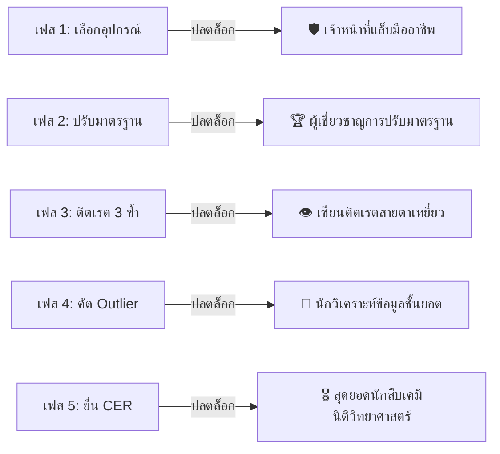

# 📘 คู่มือการใช้งานเกมและเฉลยแนวทางคำตอบ 100% (TITRA: The Chemical Investigation)

คู่มือฉบับสมบูรณ์นี้ประกอบด้วย **วิธีการใช้งานระบบเกม กติกา เครื่องมือ** และ **เฉลยขั้นตอนการเล่นเพื่อคว้าคะแนนสูงสุด (1,085+ XP พร้อม 5/5 เหรียญเกียรติยศ)** สำหรับเกมสืบสวนนิติวิทยาศาสตร์เคมี **TITRA**

---

## 📑 สารบัญ
1. [กติกาและระบบการเล่น (Game Mechanics & Rules)](#1-กติกาและระบบการเล่น)
2. [คู่มือการใช้งานเวิร์กสเตชัน (Workstations Overview)](#2-คู่มือการใช้งานเวิร์กสเตชัน)
3. [ระบบคำแนะนำ 3 ระดับ (Adaptive Hint System)](#3-ระบบคำแนะนำ-3-ระดับ)
4. [🎯 เฉลยแนวทางคำตอบพิชิตคะแนนสูงสุด (100% Walkthrough & Answer Key)](#4-เฉลยแนวทางคำตอบพิชิตคะแนนสูงสุด)
   - [เฟสที่ 1: การเปิดใช้งานกรณีฉุกเฉิน (Emergency Activation)](#เฟสที่-1-การเปิดใช้งานกรณีฉุกเฉิน)
   - [เฟสที่ 2: การปรับมาตรฐานสารละลาย (Standardization)](#เฟสที่-2-การปรับมาตรฐานสารละลาย)
   - [เฟสที่ 3: การวิเคราะห์การติตเรต (Virtual Titration)](#เฟสที่-3-การวิเคราะห์การติตเรต)
   - [เฟสที่ 4: การตีความและวิเคราะห์ข้อมูล (Evidence Interpretation)](#เฟสที่-4-การตีความและวิเคราะห์ข้อมูล)
   - [เฟสที่ 5: สรุปคำตัดสินปิดคดีด้วยหลัก CER (Final Verdict)](#เฟสที่-5-สรุปคำตัดสินปิดคดีด้วยหลัก-cer)
5. [🏆 รายชื่อเหรียญเกียรติยศทั้งหมด (Badges List)](#5-รายชื่อเหรียญเกียรติยศทั้งหมด)

---

## 1. กติกาและระบบการเล่น

> [!NOTE]
> **ไม่มีหน้า GameOver (Learning Loop System)**
> เกมใช้ระบบการเรียนรู้แบบไม่มีวันแพ้ (Non-punitive Learning Loop) หากผู้เล่นเลือกคำตอบคลาดเคลื่อน ระบบจะหัก XP เพียงเล็กน้อย (-10 ถึง -20 XP) พร้อมแสดงข้อความแนะนำเป็นภาษาไทย และเปิดโอกาสให้แก้ไขคำตอบใหม่ได้ทันที

* **ระบบคะแนน XP**: เริ่มต้นด้วย 150 XP เมื่อทำภารกิจแต่ละเฟสสำเร็จจะได้รับ XP โบนัส (+100 ถึง +300 XP)
* **การบันทึกข้อมูลอัตโนมัติ**: ความคืบหน้า คะแนน เหรียญรางวัล และบันทึกการทดลองจะถูกบันทึกลงใน `Local Storage` ของเบราว์เซอร์โดยอัตโนมัติ
* **การสลับเวิร์กสเตชัน**: สามารถกดสลับดูไฟล์คดี, สารมาตรฐาน, เครื่องติตเรต, การคำนวณ, สมุดบันทึก และรายงาน CER ได้จากแถบเมนูด้านบน (Tab Bar)

---

## 2. คู่มือการใช้งานเวิร์กสเตชัน

| เวิร์กสเตชัน | หน้าที่หลัก | สิ่งที่ต้องทำ |
| :--- | :--- | :--- |
| 🛡️ **1. ไฟล์คดี (Case File)** | รับข้อมูลคดีและเตรียมอุปกรณ์ | อ่านรายงานคดี เลือกอุปกรณ์ติตเรตที่จำเป็น 6 ชิ้น |
| 🧪 **2. สารมาตรฐาน (Standardization)** | ปรับมาตรฐานเบส NaOH | ชั่งมวล KHP ปรับมาตรฐานและคำนวณหา Molarity NaOH |
| 💧 **3. การติตเรต (Analysis)** | จำลองการติตเรตกรด-เบส | ควบคุมบิวเรตต์ สังเกตสีฟีนอล์ฟทาเลอีน และบันทึกจุดยุติ 3 ซ้ำ |
| 📊 **4. การคำนวณ (Calculation)** | วิเคราะห์ข้อมูลและคำนวณความเข้มข้น | คัดแยกค่า Outlier หาค่าเฉลี่ย และคำนวณ $C_1V_1 = C_2V_2$ |
| 📜 **5. รายงาน CER (Final Verdict)** | สรุปรายงานยื่นต่อศาล | เลือก Claim (ข้อสรุป), Evidence (หลักฐาน), Reasoning (เหตุผล) |
| 📖 **สมุดบันทึก (Notebook)** | บันทึกคู่มือและข้อสังเกต | ดูสูตรเคมี ตารางเปลี่ยนสีอินดิเคเตอร์ และจดโน้ตส่วนตัว |

---

## 3. ระบบคำแนะนำ 3 ระดับ

หากเกิดข้อสงสัย ผู้เล่นสามารถกดปุ่ม **"ขอคำแนะนำ"** (สีฟ้า ด้านขวาบน) ได้ตลอดเวลา:
1. **ระดับ 1 (Concept Hint)**: อธิบายทฤษฎีและมโนทัศน์เคมีที่เกี่ยวข้อง
2. **ระดับ 2 (Notebook Reference)**: ระบุสูตรและตารางอ้างอิงจากสมุดบันทึก
3. **ระดับ 3 (Reveal Answer)**: อธิบายขั้นตอนและคำตอบตรงจุด

---

## 4. 🎯 เฉลยแนวทางคำตอบพิชิตคะแนนสูงสุด

### เฟสที่ 1: การเปิดใช้งานกรณีฉุกเฉิน
* **เป้าหมาย**: เลือกอุปกรณ์ห้องปฏิบัติการที่มีความแม่นยำสูงสำหรับการติตเรตให้ถูกต้องครบถ้วน

> [!IMPORTANT]
> **รายการอุปกรณ์ที่ต้องเลือก (เลือกเฉพาะ 6 ชิ้นนี้):**
> 1. ✅ **บิวเรตต์ (Burette 50 mL)**
> 2. ✅ **ปิเปตต์ปริมาตร (Volumetric Pipette 25 mL)**
> 3. ✅ **ขวดรูปชมพู่ (Erlenmeyer Flask 250 mL)**
> 4. ✅ **อินดิเคเตอร์ฟีนอล์ฟทาเลอีน (Phenolphthalein Indicator)**
> 5. ✅ **ขาตั้งและที่จับบิวเรตต์ (Ring Stand & Clamp)**
> 6. ✅ **ขวดฉีดน้ำกลั่น (Wash Bottle with Distilled Water)**
>
> ❌ *ห้ามเลือก กระบอกตวง 100 mL และ เทอร์โมมิเตอร์ (อุปกรณ์หลอกคลาดเคลื่อน)*

* **ผลลัพธ์**: รับ **+100 XP** และปลดล็อกเหรียญ `เจ้าหน้าที่แล็บมืออาชีพ`

---

### เฟสที่ 2: การปรับมาตรฐานสารละลาย
* **เป้าหมาย**: คำนวณความเข้มข้นที่แน่นอนของโซเดียมไฮดรอกไซด์ (NaOH) ด้วยสารมาตรฐานปฐมภูมิ KHP

> [!TIP]
> **ค่าตัวเลขเฉลย:**
> * **มวลของ KHP (กรัม)**: กรอก `0.4085` g
> * **ปริมาตร NaOH ที่ใช้ (mL)**: กรอก `20.00` mL
>
> **สูตรการคำนวณ:**
> $$M_{\text{NaOH}} = \frac{\text{มวล KHP}}{204.22} \times \frac{1000}{\text{ปริมาตร NaOH}} = \frac{0.4085}{204.22} \times \frac{1000}{20.00} = 0.1000\text{ M}$$

* **ผลลัพธ์**: รับ **+150 XP** และปลดล็อกเหรียญ `ผู้เชี่ยวชาญการปรับมาตรฐาน`

---

### เฟสที่ 3: การวิเคราะห์การติตเรต (Virtual Titration)
* **เป้าหมาย**: ทำการติตเรตตัวอย่างน้ำปนเปื้อน 25.00 mL ครบ 3 ซ้ำ และสังเกตจุดยุติสีชมพูระเรื่อ

#### ขั้นตอนการติตเรตแต่ละ Trial:
1. **Trial 1 (ตัวอย่าง A)**:
   - กดปุ่ม `+ 1.0 mL` จนปริมาตรถึงประมาณ 24.00 mL
   - กดปุ่ม `+ 0.10 mL` หรือ `+ 0.05 mL` ค่อยๆ หยดจนได้ปริมาตร **24.80 mL** (สังเกตสารละลายเปลี่ยนเป็นสีชมพูระเรื่อ pH ≈ 8.8)
   - กดปุ่ม **"บันทึกผลจุดยุติของ Trial 1"**
2. **Trial 2 (ตัวอย่าง A)**:
   - หยดจนได้ปริมาตร **24.85 mL** (ชมพูระเรื่อ)
   - กดปุ่ม **"บันทึกผลจุดยุติของ Trial 2"**
3. **Trial 3 (ตัวอย่าง A)**:
   - หยดจนได้ปริมาตร **28.50 mL** (เกิดฟองอากาศในปลายบิวเรตต์ ทำให้ปริมาตรเกิน / Outlier)
   - กดปุ่ม **"บันทึกผลจุดยุติของ Trial 3"**

* **ผลลัพธ์**: รับ **+200 XP** และปลดล็อกเหรียญ `เซียนติตเรตสายตาเหยี่ยว`

---

### เฟสที่ 4: การตีความและวิเคราะห์ข้อมูล
* **เป้าหมาย**: ตรวจหาค่าคลาดเคลื่อน (Outlier) คำนวณปริมาตรเฉลี่ย และหาความเข้มข้นของกรดสารพิษ

> [!IMPORTANT]
> **ค่าตัวเลขเฉลย:**
> 1. **เลือกค่า Outlier**: เลือก `Trial 3 (28.50 mL - มีฟองอากาศ)`
> 2. **ปริมาตรเฉลี่ยของ NaOH (mL)**: กรอก `24.825` mL
>    - *คำนวณจาก:* $\bar{V} = \frac{24.80 + 24.85}{2} = 24.825\text{ mL}$
> 3. **ความเข้มข้นของกรดสารพิษ ($C_1$ หรือ $M_{\text{Acid}}$)**: กรอก `0.0993` M
>    - *คำนวณจากสูตร $C_1V_1 = C_2V_2$:*
>      $$C_1 \times 25.00\text{ mL} = 0.1000\text{ M} \times 24.825\text{ mL} \implies C_1 = 0.0993\text{ M}$$

* **ผลลัพธ์**: รับ **+200 XP** และปลดล็อกเหรียญ `นักวิเคราะห์ข้อมูลชั้นยอด`

---

### เฟสที่ 5: สรุปคำตัดสินปิดคดีด้วยหลัก CER
* **เป้าหมาย**: ร่างรายงานสรุปผลการสืบสวนเชิงนิติวิทยาศาสตร์เคมีเพื่อยื่นต่อศาล

#### รายการเฉลยในแบบฟอร์ม CER:

1. **ข้ออ้างอิงสรุปผล (Claim)**:
   - 🔘 **เลือกข้อที่ 1**: *"น้ำประปาปนเปื้อนด้วยสารพิษกรดซัลฟิวริก (H₂SO₄) ความเข้มข้น 0.0993 M ซึ่งสูงกว่ามาตรฐานความปลอดภัย 10 เท่า"*

2. **หลักฐานสนับสนุนทางวิทยาศาสตร์ (Evidence)** (ติ๊กเลือก 4 ข้อดังนี้):
   - ☑️ **ข้อที่ 1**: การปรับมาตรฐานเบส NaOH ด้วย KHP (0.4085 g) ให้ความเข้มข้นที่แน่นอนเท่ากับ 0.1000 M
   - ☑️ **ข้อที่ 2**: ปริมาตร NaOH ที่ใช้ติตเรตตัวอย่าง 25.00 mL ใน Trial 1 (24.80 mL) และ Trial 2 (24.85 mL) ได้ค่าเฉลี่ยสอดคล้องกันคือ 24.825 mL
   - ☑️ **ข้อที่ 3**: อินดิเคเตอร์ฟีนอล์ฟทาเลอีนเปลี่ยนจากไม่มีสีเป็นสีชมพูระเรื่อที่จุดยุติพอดี
   - ☑️ **ข้อที่ 4**: Trial 3 มีปริมาตร 28.50 mL ถูกระบุว่าเป็น Outlier จากฟองอากาศในบิวเรตต์ จึงตัดออกจากการคำนวณ
   - 🟩 *เว้นว่างข้ออุณหภูมิห้องและข้อกระบอกตวง (หลักฐานไม่เกี่ยวข้อง)*

3. **การเชื่อมโยงเหตุผลทางเคมี (Reasoning)**:
   - 🔘 **เลือกข้อที่ 1**: *"ตามปฏิกิริยาการสะเทิน H⁺ + OH⁻ → H₂O เมื่อรู้ความเข้มข้นเบส NaOH ที่แน่นอน (0.1000 M) จากการทำ Standardization และปริมาตรเฉลี่ยของเบสที่ใช้ปฏิกิริยาสะเทินสมบูรณ์ (24.825 mL จากค่าที่ไม่มี Outlier) สามารถคำนวณความเข้มข้นของกรดในน้ำปนเปื้อนได้จากสูตร C₁V₁ = C₂V₂ ได้เท่ากับ 0.0993 M ซึ่งยืนยันว่าระดับความพิษสูงเกินเกณฑ์ปลอดภัยอย่างมีนัยสำคัญ"*

* **ผลลัพธ์**: กด **"ส่งรายงาน CER ยื่นต่อศาลเพื่อปิดคดี"** ➔ เอฟเฟกต์ พลุกระดาษฉลองชัยชนะ (Confetti), รับ **+300 XP**, ปลดล็อกเหรียญ `สุดยอดนักสืบเคมีนิติวิทยาศาสตร์`, และรับใบประกาศเกียรติคุณปิดคดีสำเร็จ 100%!

---

## 5. 🏆 รายชื่อเหรียญเกียรติยศทั้งหมด

| ไอคอน | ชื่อเหรียญเกียรติยศ | เงื่อนไขการปลดล็อก |
| :---: | :--- | :--- |
| 🛡️ | **เจ้าหน้าที่แล็บมืออาชีพ** | เลือกอุปกรณ์จำเป็นครบ 6 ชิ้นในเฟส 1 โดยไม่เลือกอุปกรณ์หลอก |
| 🏆 | **ผู้เชี่ยวชาญการปรับมาตรฐาน** | กรอกมวล KHP 0.4085g และปริมาตร NaOH 20.00mL ได้ความเข้มข้น 0.1000 M |
| 👁️ | **เซียนติตเรตสายตาเหยี่ยว** | ทำการติตเรตและบันทึกปริมาตรจุดยุติครบทั้ง 3 Trial ในเฟส 3 |
| 🧮 | **นักวิเคราะห์ข้อมูลชั้นยอด** | ระบุ Trial 3 เป็น Outlier คำนวณปริมาตรเฉลี่ย 24.825 mL และความเข้มข้น 0.0993 M |
| 🎖️ | **สุดยอดนักสืบเคมีนิติวิทยาศาสตร์** | ส่งรายงาน CER ที่ถูกทุกข้อในเฟส 5 และปิดคดีสำเร็จ 100% |

---
*จัดทำขึ้นสำหรับเกม **TITRA: The Chemical Investigation** (CSI Forensic Chemistry Simulator)*
